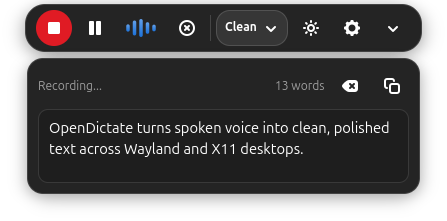
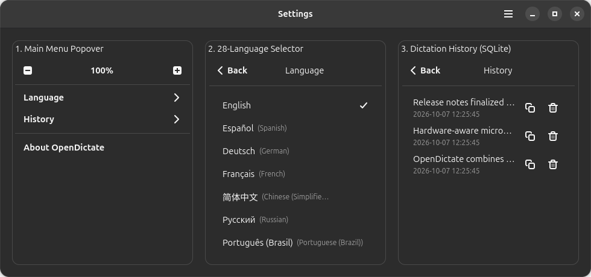

# OpenDictate

[](https://www.rust-lang.org)
[](https://gtk.org)
[](https://gnome.pages.gitlab.gnome.org/libadwaita/)
[](LICENSE)
[](docs/PACKAGING.md#7-internationalization-i18n--localized-desktops)
[](https://github.com/hkumarsaikia/OpenDictate/releases/tag/v2.0.0)

**OpenDictate** is a native Linux voice dictation and AI speech-to-text application built in 100% pure Rust with GTK 4.12+, Libadwaita 1.5+, and Relm4. It combines private on-device Whisper transcription with multi-provider Cloud AI models to turn spoken voice into clean, polished text across Wayland and X11 desktops.

| Main Settings Dashboard (Dark & Light) | Floating MiniBar & Header Menu |
| :---: | :---: |
|  | <br><br> |

---

## Highlights

- **Dual-Engine Speech Recognition:** Switch seamlessly between 100% offline on-device `whisper.cpp` models (`tiny`, `base`, `small`, `medium`) and Cloud AI providers (**Groq, Google Gemini, OpenAI, Claude, Mistral, NVIDIA NIM, Cohere, Kilo Code, Cerebras, OpenCode, OpenRouter, Hugging Face, and Ollama**).
- **Floating MiniBar Overlay:** Compact recording pill (`opendictate --minibar`) with real-time 60 FPS waveform visualization, tone presets, and an expandable live transcript drawer.
- **Hardware-Aware Microphone Routing:** Automatically detects Bluetooth headsets (`Handsfree`), wired/USB headsets (`Headphones`), or built-in microphones (`System Default`) with exclusive single-device capture.
- **28-Language Localization & SQLite History:** Instant in-place UI translation across 28 desktop languages (`English` default) and an in-popover SQLite dictation history viewer (`~/.local/share/opendictate/history.db`).
- **Automated Crash Recovery:** Built-in panic hook and compact post-crash recovery dialog with privacy-sanitized diagnostics (`~` path anonymization and API key redaction) and 1-click GitHub Issue reporting.
- **Universal & AVX2 Builds:** Ships both a baseline `universal` x86_64 binary and an `avx2` FMA-accelerated build.

---

## Quick Start & Installation

Download pre-built packages directly from **[GitHub Releases (`v2.0.0`)](https://github.com/hkumarsaikia/OpenDictate/releases/tag/v2.0.0)**:

### 1. Run Instantly Without Installing (Portable AppImage)
```bash
curl -fL https://github.com/hkumarsaikia/OpenDictate/releases/download/v2.0.0/OpenDictate-2.0.0-x86_64.AppImage -o OpenDictate.AppImage && chmod +x OpenDictate.AppImage && ./OpenDictate.AppImage
```

### 2. Debian, Ubuntu, Linux Mint, Zorin OS, Kali & elementary OS (`.deb`)
```bash
# Install AVX2-accelerated package (Intel Haswell 2013+ / AMD Zen 2017+)
sudo apt install ./opendictate_2.0.0_avx2_amd64.deb

# Or install Universal x86_64 package (older CPUs)
sudo apt install ./opendictate_2.0.0_universal_amd64.deb
```

### 3. Universal Flatpak & Canonical Snap
```bash
# Flatpak bundle
flatpak install --user opendictate_2.0.0_amd64.flatpak
flatpak run io.github.opendictate.OpenDictate

# Snap package
sudo snap install --dangerous opendictate_2.0.0_amd64.snap
sudo snap connect opendictate:audio-record
```

### 4. Build from Source (Cargo)
```bash
sudo apt-get install -y build-essential cmake clang pkg-config libssl-dev libasound2-dev libgtk-4-dev libadwaita-1-dev libdbus-1-dev
cargo build --release
./target/release/opendictate
```

---

## Command Line Usage

```bash
opendictate             # Launch main settings window
opendictate --minibar   # Launch compact floating MiniBar overlay
opendictate --toggle    # Toggle recording on/off (bind to global desktop shortcut)
opendictate --help      # Show CLI options
```

---

## Supported Linux Distributions (2018–2026)

OpenDictate supports **Ubuntu**, **Linux Mint**, **Debian**, **Arch Linux**, **Fedora**, **Kali Linux**, **Manjaro**, **openSUSE**, **elementary OS**, **Zorin OS**, **Linux Lite**, and **SteamOS** across both native host packages (`.deb`, RPM, Cargo) and sandboxed runtimes (`Flatpak` GNOME 48, `Snap` core24). See the **[Universal Packaging & Compatibility Guide](docs/PACKAGING.md)** for the full 2018–2026 matrix.

---

<details>
<summary><strong>📖 View Annotated Interface Guide & Control Reference</strong></summary>

<br>

### 1. Main Settings Window


- **`1` Main Menu (`☰`)**: MiniBar zoom controls (`75%`–`175%`), 28-language selector, SQLite dictation history, and About dialog.
- **`2` Theme Selector**: Switches between **Dark** and **White** (Light) themes.
- **`3`–`7` Cloud AI Controls**: Provider selector, API key manager, searchable model picker, and live rate-limit inspector.
- **`8`–`11` Local AI Controls**: Offline `whisper.cpp` toggle, GGML model selector (`Tiny`, `Base`, `Small`, `Medium`), model downloader, and CPU thread selector.
- **`12`–`14` General Controls**: Hardware-aware microphone selector (`System Default`, `Headphones`, `Handsfree`), global shortcut recorder, and atomic config save.

### 2. Header Menu Popover


- **`1`–`4` Top Menu**: MiniBar zoom controls, in-popover sliding submenus for **Language** and **History**, and **About OpenDictate**.
- **`5`–`8` Subpages**: 28-language selector with instant retranslation and SQLite history entries with hover tooltips, clipboard copy (`📋`), and delete (`🗑`).

### 3. Floating MiniBar Overlay


- **`1`–`7` Recording Pill**: Record/Stop, Pause/Resume, 60 FPS 5-bar waveform visualizer, Cancel, Writing Tone selector (`Clean`, `Professional`, `Casual`, `Bullet Points`), Quick Theme toggle, and Settings button.
- **`8`–`11` Live Transcript Drawer**: Drawer expander, live status & word count bar, Clear/Copy buttons, and editable transcript view.

</details>

---

## License

OpenDictate is free and open-source software licensed under the [MIT License](LICENSE).
