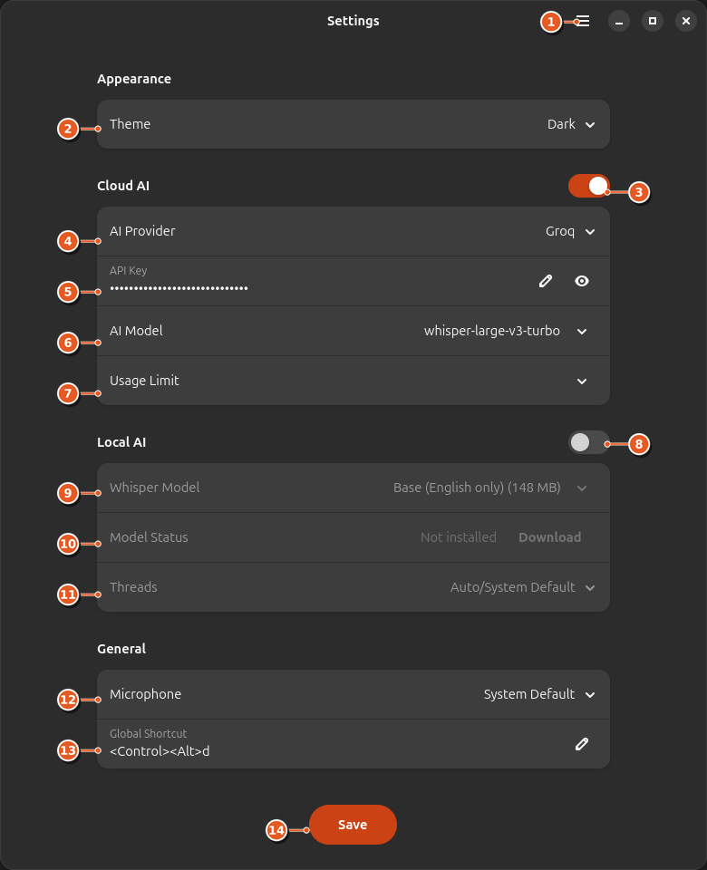
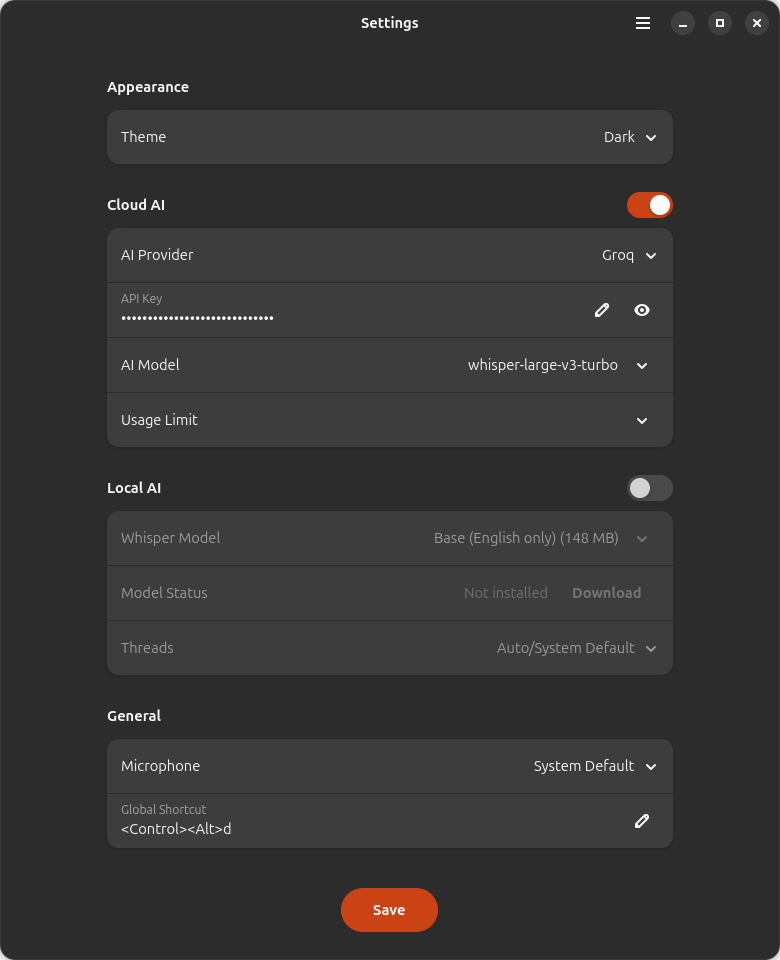
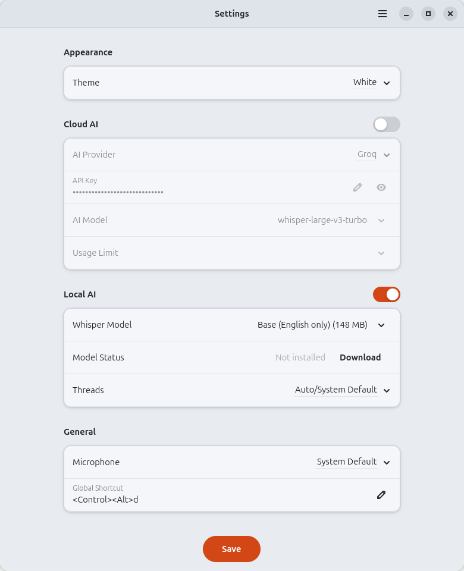
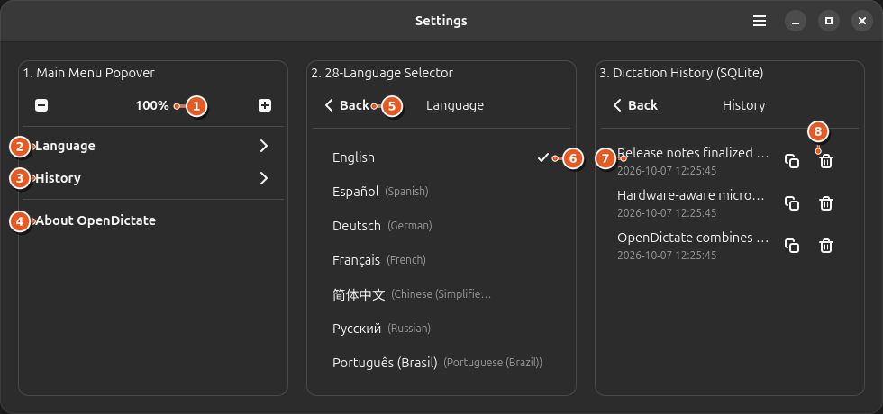
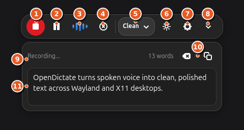

# OpenDictate

[](https://www.rust-lang.org)
[](https://gtk.org)
[](https://gnome.pages.gitlab.gnome.org/libadwaita/)
[](LICENSE)
[](docs/PACKAGING.md#7-internationalization-i18n--localized-desktops)
[](packaging/flatpak/io.github.opendictate.OpenDictate.yml)
[](snap/snapcraft.yaml)
[](build_rust_deb.sh)
[](docs/PACKAGING.md)

**OpenDictate** is a native Linux voice dictation and AI speech-to-text application. It combines private offline transcription with multi-provider Cloud AI models to turn spoken voice into clean, polished text.

Built with Rust (2024 edition), GTK 4.12+, Libadwaita 1.5+, and Relm4, OpenDictate integrates with both Wayland and X11 desktop environments, providing a floating MiniBar recording overlay, system tray indicator, and dual-engine speech recognition powered by embedded `whisper.cpp` and Cloud AI providers.

---

## Key Features

- **Native GTK4 & Libadwaita Interface:** Built with Relm4, GTK 4.12+, and Libadwaita 1.5+ with adaptive Dark and White theme synchronization.
- **Offline On-Device Transcription:** In-process `whisper.cpp` speech engine (`whisper-rs 0.16.0`) supporting quantized GGML models (`tiny`, `base`, `small`, `medium`).
- **Dual-Engine Speech Recognition:** Switch between local offline Whisper models and Cloud AI providers (Groq, Google Gemini, OpenAI, Claude, Mistral, NVIDIA NIM, Cohere, Kilo Code, Cerebras, OpenCode, OpenRouter, Hugging Face, and Ollama) with live audio capability and rate-limit inspection.
- **Hardware-Aware Microphone Routing:** Automatically detects connected Bluetooth earphones/headsets (`Handsfree`), wired 3.5mm TRRS / USB headsets (`Headphones`), or internal microphones (`System Default`), supports manual user overrides, and enforces exclusive single-device audio capture.
- **28-Language Interface Localization:** Full desktop UI translated across 28 languages with English (`en`) as the default locale, real-time in-place retranslation (`ui_language` configuration), and Right-to-Left layout support.
- **In-Popover Dictation History:** Header menu with sliding stack navigation, embedded SQLite history storage (`history.db`), full-transcript hover tooltips, clipboard copy, and individual record deletion.
- **Dual-Variant Hardware Support:** Ships both a baseline `universal` x86_64 build (for legacy CPUs without AVX2) and an `avx2` vector-accelerated build (for Intel Haswell 2013+ and AMD Zen 2017+ CPUs).
- **Wayland & X11 Desktop Integration:** XDG Desktop Portal integration, StatusNotifierItem system tray (`ksni`), global shortcuts, and automatic text insertion.
- **Floating MiniBar:** Compact recording overlay (`opendictate --minibar`) with real-time 60 FPS acoustic waveform visualization and expandable live transcript drawer.
- **Multi-Rate Audio Pipeline:** Automatic sample rate conversion (8 kHz to 192 kHz → 16 kHz mono PCM) using `cpal` and `rubato` with DC offset removal.

---

## Interface Overview & Element Labelling

### 1. Main Settings Window



| Label | Interface Element | Description & Functionality |
| :---: | :--- | :--- |
| **`1`** | **Main Menu Button (`☰`)** | Opens the header popover containing MiniBar zoom controls, the 28-language selector, SQLite dictation history, and the About dialog. |
| **`2`** | **Theme Selector** | Switches the application appearance between **Dark** and **White** (Light) themes, synchronizing both the main dashboard and floating MiniBar. |
| **`3`** | **Cloud AI Toggle** | Enables Cloud AI transcription and disables Local AI (mutually exclusive engine selection). |
| **`4`** | **AI Provider Selector** | Selects the active Cloud AI provider (`Groq`, `Google Gemini`, `OpenAI`, `Claude`, `Mistral`, `NVIDIA NIM`, `Cohere`, `Kilo Code`, `Cerebras`, `OpenCode`, `OpenRouter`, `Hugging Face`, or `Ollama`). |
| **`5`** | **API Key Entry & Controls** | Stores the provider API key with inline edit (`✎`) and password visibility toggle (`👁`) buttons. |
| **`6`** | **AI Model Picker** | Opens a searchable model selector with live verification of audio input capability and context window limits (e.g., `whisper-large-v3-turbo`). |
| **`7`** | **Usage Limit Inspector** | Displays live API rate limits (Requests/Min, Requests/Day, Tokens/Min, and remaining quota) for the active provider key and model. |
| **`8`** | **Local AI Toggle** | Enables 100% offline, on-device speech recognition via `whisper.cpp` and disables Cloud AI. |
| **`9`** | **Whisper Model Selector** | Selects the local quantized GGML model (`Tiny`, `Base`, `Small`, `Medium`, or a custom `.bin` file path). |
| **`10`** | **Model Status & Manager** | Displays whether the selected Whisper model is installed on disk and provides one-click **Download** (with progress bar) or **Delete** actions. |
| **`11`** | **Threads Selector** | Configures CPU thread allocation for local Whisper inference (`Auto/System Default`, preset thread counts `1`–`16`, or custom thread count). |
| **`12`** | **Microphone Selector** | Hardware-aware audio input selector (`System Default`, `Headphones`, `Handsfree`). Automatically adapts when wired headsets or Bluetooth earphones are connected, while allowing manual user selection and enforcing exclusive single-device capture. |
| **`13`** | **Global Shortcut Recorder** | Configures the system-wide keyboard shortcut (`<Control><Alt>d` by default) to toggle voice dictation from any window. |
| **`14`** | **Save Button** | Validates and persists all configuration changes atomically to `~/.config/opendictate/config.json`. |

<details>
<summary><strong>View Adaptive White (Light) Theme & Unannotated Main Window Screenshots</strong></summary>

<br>

| Dark Theme (Cloud AI Active) | White Theme (Local AI Active) |
| :---: | :---: |
|  |  |

</details>

---

### 2. Header Menu Popover, 28-Language Selector & Dictation History



| Label | Interface Element | Description & Functionality |
| :---: | :--- | :--- |
| **`1`** | **MiniBar Zoom Controls (`-` / `100%` / `+`)** | Adjusts the UI scale of the floating MiniBar overlay between `75%` and `175%`, with one-click reset to `100%`. |
| **`2`** | **Language Submenu (`Language →`)** | Navigates in-place within the popover stack to the 28-language selector without closing the popover. |
| **`3`** | **History Submenu (`History →`)** | Navigates in-place within the popover stack to the persistent SQLite dictation history viewer. |
| **`4`** | **About OpenDictate** | Opens the Libadwaita `AboutDialog` displaying application version, license, and issue tracker links. |
| **`5`** | **In-Popover Back Button (`< Back`)** | Returns smoothly to the top-level menu page via horizontal stack slide transition. |
| **`6`** | **28-Language List & Active Checkmark (`✓`)** | Lists all 28 supported desktop languages with native endonyms (`English` default). Selecting any language immediately retranslates the entire UI in place. |
| **`7`** | **Dictation History Entry** | Displays a timestamped preview of past dictations stored in `~/.local/share/opendictate/history.db` (hovering reveals the full transcript in a tooltip). |
| **`8`** | **Copy & Delete Record Buttons** | Copies the full transcript to the system clipboard (`📋`) or permanently deletes the entry from SQLite (`🗑`). |

---

### 3. Floating MiniBar Overlay & Live Transcript Drawer



| Label | Interface Element | Description & Functionality |
| :---: | :--- | :--- |
| **`1`** | **Record / Stop Button** | Starts voice dictation or stops and submits the recording for transcription (pulses red while recording). |
| **`2`** | **Pause / Resume Button** | Temporarily pauses microphone capture during a dictation session and resumes cleanly without losing prior audio. |
| **`3`** | **60 FPS Waveform Visualizer** | Real-time 5-bar acoustic level visualizer driven by RMS audio energy with ambient silence noise-gating. |
| **`4`** | **Cancel Recording Button (`⊗`)** | Aborts the current recording session immediately and discards captured audio. |
| **`5`** | **Writing Tone Selector** | Selects the output formatting style (`Clean`, `Professional`, `Casual`, or `Bullet Points`). |
| **`6`** | **Quick Theme Toggle (`☀`)** | Toggles between Dark and White themes directly from the floating MiniBar. |
| **`7`** | **Settings Dashboard Button (`⚙`)** | Opens or brings focus to the main OpenDictate Settings window. |
| **`8`** | **Drawer Expander Button (`⌄`)** | Expands or collapses the live transcript drawer below the recording pill. |
| **`9`** | **Status & Word Count Bar** | Displays current activity (`Ready`, `Recording...`, `Transcribing...`) alongside a live word counter (`13 words`). |
| **`10`** | **Clear & Copy Transcript Buttons** | Clears the current drawer text buffer or copies the transcript to the clipboard. |
| **`11`** | **Editable Transcript View** | Displays the latest transcription output and supports direct inline keyboard editing. |

---

## Architecture Overview

```text
OpenDictate/
├── Cargo.toml                 # Crate manifest (Rust 2024 edition) and dependencies
├── data/                      # FreeDesktop .desktop entry and AppStream metainfo.xml
├── docs/                      # Packaging guide and annotated UI screenshots
├── packaging/                 # Flatpak (GNOME 48) and AppImage build manifests
├── snap/                      # Canonical Snap Store manifest (snapcraft.yaml, core24)
├── src/
│   ├── main.rs                # Application entrypoint and single-instance / CLI dispatch
│   ├── lib.rs                 # Library root exporting core modules
│   ├── cli.rs                 # Command-line argument parser (--minibar, --toggle, etc.)
│   ├── config.rs              # Persistent JSON configuration (~/.config/opendictate/config.json)
│   ├── audio/                 # CPAL audio capture, Rubato 16 kHz resampler, and RMS level meter
│   ├── services/
│   │   ├── ai/                # Local Whisper GGML engine and Cloud AI provider clients
│   │   ├── dictation_worker.rs# Background transcription & text enhancement worker
│   │   ├── hotkey.rs          # XDG GlobalShortcuts portal and desktop hotkey integration
│   │   ├── i18n.rs            # Static 28-language UI translation catalog (English default)
│   │   ├── storage.rs         # SQLite persistence for dictation history (history.db)
│   │   └── tray.rs            # D-Bus StatusNotifierItem system tray service
│   └── ui/
│       ├── main_window/       # Libadwaita main window, header menu popover, and settings view
│       ├── mini_bar/          # Floating recording pill, waveform visualizer, and drawer
│       ├── theme.rs           # Adaptive CSS theme compiler and stylesheet loader
│       └── assets/brand/      # Scalable SVG and hicolor PNG application icons
└── tests/                     # Integration, UI, audio, storage, and packaging test suites
```

---

## Installation & Packaging

OpenDictate is packaged for direct installation across modern and legacy Linux distributions. For full details, refer to the **[Universal Packaging Guide](docs/PACKAGING.md)**.

### 1. Flatpak (Flathub Standard)

Recommended for all desktop distributions and immutable operating systems (Fedora Silverblue, SteamOS). Uses the `org.gnome.Platform//48` runtime:

```bash
# Install runtime prerequisites
flatpak install -y flathub org.gnome.Platform//48 org.gnome.Sdk//48

# Build and install locally
flatpak-builder --user --install --force-clean build-flatpak packaging/flatpak/io.github.opendictate.OpenDictate.yml

# Run
flatpak run io.github.opendictate.OpenDictate
```

### 2. Canonical Snap Store (`snap/snapcraft.yaml`)

Configured at `snap/snapcraft.yaml` with strict confinement (`base: core24`) and the `gnome` extension:

```bash
# Build and install local snap
snapcraft --use-lxd
sudo snap install --dangerous opendictate_2.0.0_amd64.snap

# Connect audio capture interface
sudo snap connect opendictate:audio-record
```

### 3. Debian & Ubuntu (`.deb`)

Download or build the native `.deb` package matching your CPU architecture:

```bash
# Check if your CPU supports AVX2 and FMA
grep -E '(avx2.*fma|fma.*avx2)' /proc/cpuinfo >/dev/null && echo "Use AVX2" || echo "Use Universal"

# Build Universal, AVX2, or both from source
bash build_rust_deb.sh --variant all

# Install AVX2 or Universal package
sudo dpkg -i dist/opendictate_2.0.0_avx2_amd64.deb
sudo apt-get install -f -y
```

### 4. Portable AppImage

```bash
bash packaging/appimage/build_appimage.sh
./build/AppDir/AppRun
```

### 5. Build from Source (Cargo)

```bash
# Install dependencies (Ubuntu/Debian)
sudo apt-get install -y build-essential cmake clang pkg-config libssl-dev libasound2-dev libgtk-4-dev libadwaita-1-dev libdbus-1-dev

# Compile release binary
cargo build --release

# Run
./target/release/opendictate
```

---

## Distribution & Compatibility Matrix (2018–2026)

OpenDictate uses a **dual runtime execution tier** model across 12 Linux distribution families from 2018 through 2026:

- **Tier 1 (Modern Native Systems: 2023–2026):** Runs natively via `.deb`, RPM, AUR, or Cargo on distributions shipping GTK 4.12+ and Libadwaita 1.4+/1.5+.
- **Tier 2 (Universal Sandboxed Systems: 2018–2022 & Immutable Desktops):** Runs via **Flatpak (`org.gnome.Platform//48`)** or **Snap (`core24`)** on older LTS releases and atomic desktops.

| Distribution Family | Verified Releases (2018–2026) | Execution Tier | Recommended Package Format | Hardware Tier |
| :--- | :--- | :--- | :--- | :--- |
| **1. Ubuntu** | `26.04 LTS`, `25.10`, `25.04`, `24.10`, `24.04 LTS`, `23.10` | **Tier 1 (Native)** | Native `.deb` / Snap / Source | AVX2 & Universal |
| | `23.04`, `22.10`, `22.04 LTS`, `21.10`–`20.04 LTS`, `19.10`–`18.04 LTS` | **Tier 2 (Sandbox)** | Flatpak / Snap | Universal & AVX2 |
| **2. Linux Mint** | `Mint 22`–`22.3` & `LMDE 7` | **Tier 1 (Native)** | Native `.deb` / Flatpak | AVX2 & Universal |
| | `Mint 19`–`19.3`, `20`–`20.3`, `21`–`21.3` & `LMDE 3`–`6` | **Tier 2 (Sandbox)** | Flatpak | Universal & AVX2 |
| **3. Debian** | `Debian 13` (Trixie) & `Sid` | **Tier 1 (Native)** | Native `.deb` / Source | AVX2 & Universal |
| | `Debian 12` (Bookworm) | **Tier 1 / Tier 2** | Flatpak (Stock) / Native `.deb` (Trixie overlay) | AVX2 & Universal |
| | `Debian 10` (Buster) & `Debian 11` (Bullseye) | **Tier 2 (Sandbox)** | Flatpak / Snap | Universal & AVX2 |
| **4. Arch Linux** | Rolling (`2018.01`–`2026.10`) | **Tier 1 (Native)** | Native AUR / Cargo / Flatpak | AVX2 & Universal |
| **5. Fedora** | `Fedora 39`–`44` Workstation | **Tier 1 (Native)** | Native RPM / Flatpak / Cargo | AVX2 & Universal |
| | `Fedora 28`–`38` & `Fedora Silverblue` | **Tier 2 (Sandbox)** | Flatpak | Universal & AVX2 |
| **6. Kali Linux** | Rolling `2023.3`–`2026.3` | **Tier 1 (Native)** | Native `.deb` / Cargo / Flatpak | AVX2 & Universal |
| | Rolling `2018.1`–`2023.2` | **Tier 2 (Sandbox)** | Flatpak | Universal & AVX2 |
| **7. Manjaro** | `23.0`–`26.0` | **Tier 1 (Native)** | Native Pacman / AUR / Flatpak | AVX2 & Universal |
| | `18.0`–`22.1` | **Tier 1 / Tier 2** | Pacman Upgrade / Flatpak | Universal & AVX2 |
| **8. openSUSE** | `Tumbleweed` (`2018`–`2026`) & `Leap 16.0` | **Tier 1 (Native)** | Native Zypper RPM / Flatpak | AVX2 & Universal |
| | `Leap 15.0`–`15.6` & `MicroOS / Aeon` | **Tier 2 (Sandbox)** | Flatpak | Universal & AVX2 |
| **9. elementary OS** | `8.0` / `8.1` (Circe) | **Tier 1 (Native)** | Native `.deb` / Flatpak | AVX2 & Universal |
| | `5.0`–`7.1` (Juno, Hera, Odin, Jólnir, Horus) | **Tier 2 (Sandbox)** | Flatpak | Universal & AVX2 |
| **10. Zorin OS** | `Zorin OS 18` | **Tier 1 (Native)** | Native `.deb` / Flatpak | AVX2 & Universal |
| | `Zorin OS 15`–`17.3` | **Tier 2 (Sandbox)** | Flatpak / Snap | Universal & AVX2 |
| **11. Linux Lite** | `Linux Lite 7.0`–`7.4` (Galena) | **Tier 1 (Native)** | Native `.deb` / Flatpak | AVX2 & Universal |
| | `Linux Lite 4.0`–`6.6` | **Tier 2 (Sandbox)** | Flatpak / Snap | Universal & AVX2 |
| **12. SteamOS** | `SteamOS 3.0`–`3.7` (Holo) & `2.195` (Brewmaster) | **Tier 2 (Sandbox)** | Flatpak (`flatpak --user`) | AVX2 & Universal |

---

## Command Line Usage

```bash
# Launch main window
opendictate

# Launch floating MiniBar
opendictate --minibar

# Toggle recording on/off (for global desktop hotkeys)
opendictate --toggle

# Display version and CLI help
opendictate --version
opendictate --help
```

---

## Development & Testing

```bash
# Run full test suite
cargo test -- --test-threads=1

# Run strict linter
cargo clippy --all-targets -- -D warnings
```

---

## License

OpenDictate is free and open-source software licensed under the [MIT License](LICENSE).
